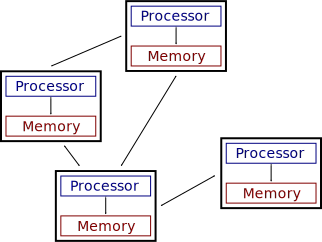

# Parallel and Distributed Computing

## Terminology

## Parallel Computing

* Running multiple computations on the same computer at the same time

## Distributed Computing

* Running a computation across multiple, networked computers at the same time

## Parallel and Distributed Computing

